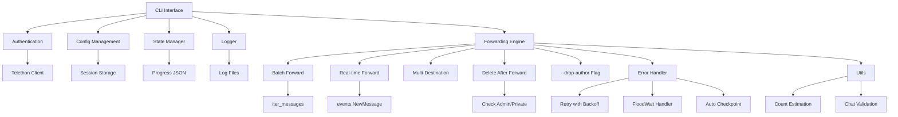

# Telegram Automations CLI

A command-line tool for automating Telegram message forwarding using Telethon.


## Features

- **Multi-Account Support**: Manage multiple Telegram accounts with easy switching
- **Batch Forwarding**: Forward up to 100 messages per API call (10-100x more efficient)
- **Multiple Destinations**: Forward to multiple chats at once
- **Drop Author**: Remove "Forwarded from" header (appears as original message)
- **Message Filters**: Filter by type, date, keywords, regex, and more
- **Message Transforms**: Modify content before forwarding (remove @mentions, links, etc.)
- **Delete After Forward**: Delete messages from source after forwarding (requires admin)
- **Real-time Forwarding**: Forward new messages as they arrive
- **Daemon Mode**: Run multiple forwarding jobs in background with `--daemon`
- **Interactive TUI**: Beautiful terminal interface for easy navigation
- **Chat Search**: Search and filter chats by name or type
- **Resume Capability**: Continue interrupted batch operations
- **Fault Tolerant**: Automatic checkpointing, graceful shutdown, flood wait handling
- **Progress Tracking**: Visual progress bars and job status

## Architecture



## Installation

```bash
git clone https://github.com/erfnzdeh/Telegram-CLI.git
cd Telegram-CLI
pip install -e .
```

## Setup

1. Get your API credentials from [my.telegram.org](https://my.telegram.org):
   - Log in with your phone number
   - Go to "API development tools"
   - Create an application to get `api_id` and `api_hash`

2. Login to Telegram:

```bash
telegram-cli login
```

You'll be prompted to enter your API credentials, phone number, and verification code.

## Multi-Account Support

Telegram CLI supports multiple Telegram accounts. Each account has its own session, configuration, and job history.

### Add Accounts

```bash
# Add your first account
telegram-cli account add personal

# Add another account
telegram-cli account add work
```

You'll be prompted for API credentials and phone verification for each account.

### List Accounts

```bash
telegram-cli account list
```

Output:
```
Registered accounts (2):
------------------------------------------------------------
  * personal        @yourname
    work            @workaccount
------------------------------------------------------------
* = active account
```

### Switch Accounts

```bash
telegram-cli account switch work
```

### Use a Specific Account for a Command

```bash
# Use the -a/--account flag to run a command with a specific account
telegram-cli -a personal list-chats
telegram-cli -a work forward-live -s -100123456 -d -100789012
```

### Account Commands

| Command | Description |
|---------|-------------|
| `account list` | List all registered accounts |
| `account add <alias>` | Add a new account |
| `account switch <alias>` | Set active account |
| `account remove <alias>` | Remove an account |
| `account rename <old> <new>` | Rename an account |
| `account info [alias]` | Show account details |

## Usage

### List Available Chats

```bash
telegram-cli list-chats
```

Output:
```
     -100123456  [  Channel  ]  My Source Channel
     -100789012  [  Channel  ]  Backup Channel
       12345678  [ Private  ]  John Doe (@johndoe)
```

**Search and filter chats:**

```bash
# Search by name
telegram-cli list-chats --search "backup"

# Filter by type
telegram-cli list-chats --type channel

# Combine filters
telegram-cli list-chats --search "news" --type channel --limit 10
```

### Interactive Mode (TUI)

Launch a beautiful interactive terminal interface:

```bash
telegram-cli tui
```

Features:
- Browse and search chats interactively
- Set up forwarding with guided prompts
- View daemon status and job history
- Easy navigation with keyboard

**Note:** Requires `rich` library (`pip install rich`)

### Test Permissions

```bash
telegram-cli test -s -100123456 -d -100789012 --delete
```

### Forward Last N Messages

```bash
# Basic forward (with "Forwarded from" header)
telegram-cli forward-last -s -100123456 -d -100789012 --count 50

# Without "Forwarded from" header
telegram-cli forward-last -s -100123456 -d -100789012 --count 50 --drop-author

# Forward to multiple destinations
telegram-cli forward-last \
    -s -100123456 \
    -d -100789012 \
    -d -100789013 \
    --count 50 \
    --drop-author

# Forward and delete from source
telegram-cli forward-last -s -100123456 -d -100789012 --count 50 --delete
```

### Forward All Messages

```bash
telegram-cli forward-all \
    -s -100123456 \
    -d -100789012 \
    --drop-author
```

Output:
```
Source: -100123456 (My Source Channel)
Destinations: -100789012
Estimated: ~12.5K messages
Mode: forward (drop author)
Batch size: 100 messages per API call

Proceed? [y/N]: y
Job ID: abc12345
[==============================] 12500/12500 (100.0%)
Complete: 12500 forwarded, 150 skipped, 0 failed
```

### Real-time Forwarding

```bash
telegram-cli forward-live \
    -s -100123456 \
    -d -100789012 \
    --drop-author
```

Press `Ctrl+C` to stop.

### Message Filtering

Filter messages by type, date, content, and more.

```bash
# Only forward photos and videos
telegram-cli forward-all -s SOURCE -d DEST --type "photo,video"

# Only messages from last 7 days
telegram-cli forward-all -s SOURCE -d DEST --after 7d

# Only messages containing "important"
telegram-cli forward-all -s SOURCE -d DEST --contains "important"

# Exclude messages with links
telegram-cli forward-all -s SOURCE -d DEST --no-links

# Complex filter: photos from last week, max 10MB
telegram-cli forward-all -s SOURCE -d DEST \
    --type photo \
    --after 1w \
    --max-size 10MB

# Use regex to filter
telegram-cli forward-all -s SOURCE -d DEST --regex "price:\s*\$\d+"
```

### Message Transforms

Transform message content before forwarding. Useful for removing mentions, links, or applying custom modifications.

```bash
# List available transforms
telegram-cli forward-live -s -100123456 -d -100789012 --list-transforms

# Remove @mentions from messages
telegram-cli forward-live \
    -s -100123456 \
    -d -100789012 \
    --transform "replace_mentions"

# Replace @mentions with custom text
telegram-cli forward-live \
    -s -100123456 \
    -d -100789012 \
    --transform "replace_mentions" \
    --transform-config "replacement=[channel]"

# Chain multiple transforms
telegram-cli forward-live \
    -s -100123456 \
    -d -100789012 \
    --transform "replace_mentions,remove_links,strip_formatting"
```

**Available Transforms:**

| Transform | Description |
|-----------|-------------|
| `replace_mentions` | Replace @username mentions |
| `remove_links` | Remove URLs |
| `remove_hashtags` | Remove #hashtags |
| `strip_formatting` | Clean up extra whitespace |
| `add_prefix` | Add text at the beginning |
| `add_suffix` | Add text at the end |
| `regex_replace` | Custom regex replacement |

### Delete Messages

```bash
# Delete last 50 messages from a chat
telegram-cli delete-last -c -100123456 --count 50

# Delete all messages from a chat
telegram-cli delete-all -c -100123456

# Preview without deleting (dry run)
telegram-cli delete-all -c -100123456 --dry-run
```

### Resume Interrupted Jobs

```bash
# List resumable jobs
telegram-cli resume

# Resume specific job
telegram-cli resume abc12345
```

### Check Job Status

```bash
telegram-cli status
```

## Command Reference

| Command | Description |
|---------|-------------|
| `login` | Authenticate with Telegram |
| `logout` | Clear session and log out |
| `account` | Manage multiple Telegram accounts |
| `list-chats` | List available chats with IDs |
| `test` | Verify permissions for source/destination |
| `forward-last` | Forward last X messages |
| `forward-live` | Start real-time forwarding |
| `forward-all` | Forward all messages in batches |
| `delete-last` | Delete last X messages from a chat |
| `delete-all` | Delete all messages from a chat |
| `resume` | Resume an interrupted operation |
| `status` | Show job history and progress |
| `tui` | Launch interactive terminal UI |
| `list` | List running background daemons |
| `kill` | Kill a background daemon by PID |
| `logs` | View daemon logs |

### Global Flags

| Flag | Description |
|------|-------------|
| `-a, --account` | Account alias to use (default: active account) |
| `-v, --verbose` | Increase verbosity (stack: -vv, -vvv) |
| `-q, --quiet` | Suppress all output except errors |
| `-y, --yes` | Skip confirmation prompts |

### Forward Flags

| Flag | Description |
|------|-------------|
| `-s, --source` | Source chat ID or @username |
| `-d, --dest` | Destination chat ID (repeatable) |
| `--drop-author` | Remove "Forwarded from" header |
| `--delete` | Delete from source after forwarding |
| `--dry-run` | Preview without executing |
| `--count` | Number of messages (forward-last) |
| `--batch-size` | Messages per batch (max 100) |
| `--daemon` | Run in background (daemon mode) |
| `--transform` | Transform chain (forward-live only) |
| `--transform-config` | Config for transform |
| `--list-transforms` | List available transforms |

### Filter Flags (for forward commands)

| Flag | Description |
|------|-------------|
| `--type` | Only these types (photo,video,text,document,audio) |
| `--exclude-type` | Exclude these types |
| `--after` | Only messages after date (YYYY-MM-DD or 7d, 1w, 1m) |
| `--before` | Only messages before date |
| `--contains` | Must contain text (repeatable, all must match) |
| `--contains-any` | Must contain any of these (repeatable) |
| `--excludes` | Must NOT contain text (repeatable) |
| `--regex` | Must match regex pattern |
| `--media-only` | Only messages with media |
| `--text-only` | Only text messages |
| `--min-size` | Minimum file size (e.g., 1MB) |
| `--max-size` | Maximum file size (e.g., 100MB) |
| `--no-replies` | Exclude reply messages |
| `--no-forwards` | Exclude forwarded messages |
| `--no-links` | Exclude messages with links |

### Delete Flags

| Flag | Description |
|------|-------------|
| `-c, --chat` | Chat ID or @username to delete from |
| `--count` | Number of messages (delete-last) |
| `--batch-size` | Messages per batch (max 100) |
| `--dry-run` | Preview without executing |

## Daemon Mode (Background Processing)

Run forwarding operations in the background. You can run multiple daemons simultaneously.

### Start a Daemon

```bash
# Run any forward command with --daemon
telegram-cli forward-all -s -100123456 -d -100789012 --daemon
telegram-cli forward-live -s -100123456 -d -100789012 --daemon
```

Output:
```
Starting daemon...
PID: 12345
Logs: telegram-cli logs 12345
Kill: telegram-cli kill 12345
List: telegram-cli list
```

### List Running Daemons

```bash
telegram-cli list
```

Output:
```
Running daemons (2):
----------------------------------------------------------------------
     PID  Command               Source        Started
----------------------------------------------------------------------
   12345  forward-all         -100123456  2026-02-02T14:30:00
   12346  forward-live        -100789012  2026-02-02T15:00:00
----------------------------------------------------------------------
Kill with: telegram-cli kill <PID>
View logs: telegram-cli logs <PID>
```

### Kill a Daemon

```bash
# Kill specific daemon by PID
telegram-cli kill 12345

# Force kill (SIGKILL)
telegram-cli kill 12345 -f

# Kill all running daemons
telegram-cli kill --all
```

### View Daemon Logs

```bash
# View logs for specific PID
telegram-cli logs 12345

# View most recent daemon logs
telegram-cli logs

# Follow logs in real-time (like tail -f)
telegram-cli logs 12345 -f

# Show last 100 lines
telegram-cli logs -n 100
```

## Configuration

Configuration is stored in `~/.telegram-cli/`:

```
~/.telegram-cli/
├── accounts.json          # Account registry (active account, metadata)
├── accounts/
│   ├── personal/          # Account directory
│   │   ├── config.json    # API credentials
│   │   ├── session.session
│   │   └── jobs.json
│   └── work/
│       └── ...
├── daemons.json           # Running daemon processes
└── logs/                  # Log files (shared)
```

**Note:** If upgrading from an older version, existing sessions are automatically migrated to the new multi-account structure.

### Environment Variables

You can also set credentials via environment variables:

```bash
export TELEGRAM_API_ID=12345678
export TELEGRAM_API_HASH=0123456789abcdef
```

## Fault Tolerance

- **Automatic Checkpointing**: Progress saved after every batch (100 messages)
- **FloodWait Handling**: Auto-sleep for rate limits up to 2 minutes
- **Connection Recovery**: Auto-reconnect and retry on failures
- **Graceful Shutdown**: `Ctrl+C` saves progress and shows resume command
- **Resume Capability**: Continue from last processed message

## Error Handling

| Error | Handling |
|-------|----------|
| FloodWaitError (<120s) | Automatic sleep and retry |
| FloodWaitError (>120s) | Sleep with countdown, retry |
| PeerFloodError | **STOP** - Account may be limited |
| ChannelPrivateError | Skip with error message |
| ChatWriteForbiddenError | Skip destination, continue |
| MessageIdInvalidError | Skip message, continue |

## License

MIT

## Disclaimer

This tool is for personal use only. Please respect Telegram's Terms of Service and don't use it for spam or abuse. You are responsible for how you use this tool.
