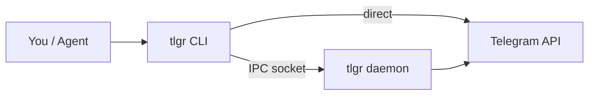
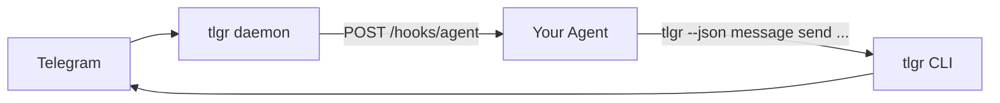
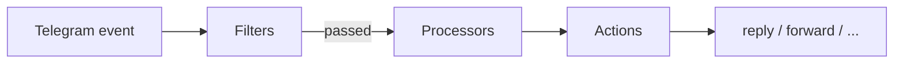

# tlgr


<!-- Created with GitHub Repo Banner by Waren Gonzaga: https://ghrb.waren.build -->

Full Telegram account control from the terminal. Agent-friendly, daemon-based, with webhook event push.

```
pip install tlgr
```

> **For agents:** Authentication requires human interaction (phone code, 2FA). Run `tlgr account add` yourself first, then hand the CLI to your agent. See [AGENT.md](AGENT.md) for the full agent reference.

## Quickstart

```bash
tlgr config init                              # create config files
tlgr login +15551234567                       # authenticate (shortcut for account add)
tlgr daemon start                             # start background daemon
tlgr send @username "Hello from tlgr"         # send a message
tlgr chats --limit 20                         # list your chats
tlgr status                                   # check daemon status
```

## CLI

Every Telegram operation available as a single command. Three output modes: human-readable tables (default), JSON (`--json`) for agents, and plain TSV (`--plain`) for piping.


```mermaid
flowchart LR
    USER["You / Agent"] --> CLI["tlgr CLI"]
    CLI -->|"direct"| TG["Telegram API"]
    CLI -->|"IPC socket"| DAEMON["tlgr daemon"]
    DAEMON --> TG
```

### Shortcuts

Common operations are available as top-level commands for quick access:

```bash
tlgr send <chat> <text>                # message send
tlgr login <phone>                     # account add
tlgr logout <alias>                    # account remove
tlgr status                            # daemon status
tlgr chats                             # chat list
tlgr contacts                          # contact list
tlgr dl <chat> <msg_id>               # media download
tlgr up <chat> <path>                 # media upload
```

### Messages

```bash
tlgr message send <chat> <text>        # --file, --caption, --reply-to, --silent
tlgr message list <chat>               # --limit, --sender, --media, --reactions
tlgr message get <chat> <msg_id>       # full metadata
tlgr message delete <chat> <ids...>
tlgr message search <chat> <query>     # --local for regex, --regex <pattern>
tlgr message pin <chat> <msg_id>
tlgr message react <chat> <id> <emoji>
```

`msg` is an alias for `message` (e.g. `tlgr msg send @user "hello"`).

### Chats

```bash
tlgr chat list                         # --type, --search, --limit
tlgr chat get <chat>
tlgr chat create <name>                # --type group|channel, --members
tlgr chat archive <chat>
tlgr chat mute <chat> [duration]
tlgr chat leave <chat>
```

### Contacts

```bash
tlgr contact list
tlgr contact add <phone> [name]
tlgr contact remove <user>
tlgr contact search <query>
```

### Media

```bash
tlgr media download <chat> <msg_id>    # --out-dir
tlgr media upload <chat> <path>        # --caption
```

### Profile

```bash
tlgr profile get
tlgr profile update                    # --first-name, --last-name, --bio, --photo
```

### Accounts

```bash
tlgr account add <phone>              # authenticate a new account
tlgr account list                     # (* = default)
tlgr account switch <alias>
tlgr account remove <alias>
tlgr account rename <old> <new>
tlgr account info [alias]
```

### Daemon

```bash
tlgr daemon start                     # --foreground
tlgr daemon stop
tlgr daemon status
tlgr daemon logs                      # --follow
```

### Global Flags

```
--json               JSON to stdout (for scripting and agents)
--plain              Stable TSV for piping
-a, --account TEXT   Account alias to use
--results-only       In JSON mode, strip envelope and emit only the primary result
--select FIELDS      In JSON mode, project comma-separated fields (supports dot paths)
--enable-commands    Comma-separated allowlist of enabled commands (sandboxing)
-n, --dry-run        Preview destructive operations without executing
-y, --force          Skip confirmations
--no-input           Never prompt; fail instead (CI/agent mode)
-v, --verbose        Verbose logging to stderr
--version / --help
```

### Environment Variables

All global flags can be set via environment variables:

| Variable | Equivalent |
|----------|------------|
| `TLGR_JSON=1` | `--json` |
| `TLGR_PLAIN=1` | `--plain` |
| `TLGR_ACCOUNT=alias` | `--account alias` |
| `TLGR_ENABLE_COMMANDS=cmd1,cmd2` | `--enable-commands cmd1,cmd2` |
| `TLGR_AUTO_JSON=1` | Auto-switch to JSON when stdout is piped (non-TTY) |

## Webhook -- Event Push

tlgr pushes Telegram events to an external HTTP endpoint in real time. Designed for agentic interfaces like [OpenClaw](https://github.com/openclaw) where an agent receives events and calls `tlgr` CLI commands to act.


```mermaid
flowchart LR
    TG["Telegram"] --> DAEMON["tlgr daemon"]
    DAEMON -->|"POST /hooks/agent"| AGENT["Your Agent"]
    AGENT -->|"tlgr --json message send ..."| CLI["tlgr CLI"]
    CLI --> TG
```

Configure in `~/.tlgr/webhook.toml`:

```toml
[webhook]
enabled = true
url = "http://127.0.0.1:18789/hooks/agent"
token = "shared-secret"
events = ["new_message", "message_edited", "message_deleted"]

[webhook.retry]
enabled = true
max_attempts = 3
backoff_base = 2

[webhook.filters]
chats = ["@important_channel"]
```

Events arrive as JSON with `Authorization: Bearer <token>`:

```json
{
  "event_type": "new_message",
  "timestamp": "2025-03-06T12:00:00Z",
  "account": "main",
  "data": { "..." }
}
```

## Gateway -- Background Jobs

tlgr also ships with a deterministic, always-on Gateway that runs background jobs on your Telegram account. Define declarative pipelines in `~/.tlgr/jobs.yaml` that automatically react to incoming messages -- auto-reply, auto-forward, filter by chat type, time of day, content, and more.


```mermaid
flowchart LR
    TG["Telegram event"] --> F["Filters"]
    F -->|"passed"| P["Processors"]
    P --> A["Actions"]
    A --> R["reply / forward / ..."]
```

A few examples of what you can do:

```yaml
jobs:
  # Auto-reply to all private messages
  - name: private-bot
    account: main
    filters:
      chat_type: private
    actions:
      - reply: "shut up i'm just a bot!"

  # Forward breaking news to your archive
  - name: news-forward
    account: main
    filters:
      chat_id: "@raw_feed"
      types: [text, photo]
      contains: [breaking]
    actions:
      - forward:
          to: ["@clean_feed", "@archive"]
          processors: [strip_formatting]

  # Night-mode auto-reply
  - name: night-mode
    account: main
    filters:
      chat_type: private
      time_of_day: "23:00-07:00"
    actions:
      - reply: "I'm sleeping. Will reply tomorrow."
```

Filters support full AND / OR / NOT composition, 20+ built-in filter types, 7 text processors, and a registry pattern for adding your own.

For the full Gateway reference -- filters, processors, actions, composition, extensibility -- see **[Gateway documentation](tlgr/gateway/README.md)**.

## Agent / Automation

tlgr is designed to be consumed by LLM agents and automation pipelines.

### Machine-readable schema

```bash
tlgr schema                            # full CLI schema as JSON
tlgr schema message send               # schema for a specific command
```

Agents can discover all commands, flags, positionals, types, and defaults without parsing `--help`.

### Stable exit codes

```bash
tlgr exit-codes                        # print the exit code table
tlgr --json agent exit-codes           # as JSON
```

| Code | Meaning |
|------|---------|
| 0 | Success |
| 1 | Generic failure |
| 2 | Usage / parse error |
| 3 | Empty results |
| 4 | Auth required |
| 5 | Not found |
| 6 | Permission denied |
| 7 | Rate limited |
| 8 | Retryable error |
| 10 | Config error |
| 11 | Daemon error |
| 12 | IPC error |
| 130 | Interrupted (SIGINT) |

### Command sandboxing

Restrict which commands an agent can run:

```bash
tlgr --enable-commands="message,chat,schema" send @user "hi"    # allowed
tlgr --enable-commands="message,chat,schema" account remove foo  # blocked (exit 2)
```

Or via environment: `TLGR_ENABLE_COMMANDS=message,chat,schema`.

### JSON transforms

```bash
tlgr --json --results-only chat list           # strip pagination/envelope, emit only the chat array
tlgr --json --select "id,name" chat list       # project specific fields
```

### Auto-JSON for pipelines

Set `TLGR_AUTO_JSON=1` and tlgr automatically outputs JSON whenever stdout is piped (non-TTY), without requiring `--json`.

### Error hints

Errors include actionable recovery hints:

```
Error: No session found for account 'main'
  Session expired. Run: tlgr account add <phone>
```

## Configuration

Config files live in `~/.tlgr/`:

| File | Format | Purpose |
|------|--------|---------|
| `config.toml` | TOML | App defaults, daemon, accounts |
| `jobs.yaml` | YAML | Gateway job definitions |
| `webhook.toml` | TOML | Outbound webhook push |

```bash
tlgr config init                       # create defaults
tlgr config validate                   # check syntax + validate filter/action names
tlgr config path                       # print config directory
tlgr config keys                       # list all known config keys
tlgr config list                       # show current values
tlgr config get <key>                  # get a single value
tlgr config set <key> <value>          # set a value
tlgr config unset <key>                # reset to default
```

### config.toml

```toml
[defaults]
output = "human"

[accounts]
default = "main"

[daemon]
auto_start = true
log_level = "info"
```

## Multi-Account

```bash
tlgr account add +15551234567 --alias personal
tlgr account add +15559876543 --alias work
tlgr -a personal message send @friend "Hi"
```

Jobs can reference different accounts:

```yaml
jobs:
  - name: work-forward
    account: work
    # ...
```

## License

See [LICENSE](LICENSE) for license details.
