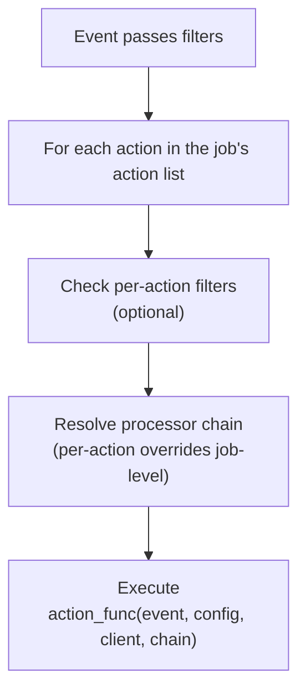

# Actions

Registry-based pipeline actions for the Gateway. Actions are the final stage
of the pipeline -- they execute side effects (sending messages, forwarding,
etc.) based on the event that passed through filters and processors.

## How it works



Every action is an async function registered with `@register_action`. Actions
receive:
- `event` -- the `Event` envelope
- `config` -- the action's YAML config value
- `client` -- a `ClientWrapper` for Telegram API calls
- `chain` -- an optional `ProcessorChain` for text modification

## Built-in actions

### reply

Sends a static text reply to the triggering message.

```yaml
actions:
  - reply: "shut up i'm just a bot!"
```

If a processor chain is provided, it's applied to the reply text before sending.

### forward

Forwards the message to one or more destinations.

```yaml
actions:
  - forward:
      to: ["@clean_feed", "@archive"]
      drop_author: true
      processors:
        - strip_formatting
```

| Config key | Type | Description |
|------------|------|-------------|
| `to` | `str` or `list[str]` | Destination chat(s) |
| `drop_author` | `bool` | Remove original author attribution |
| `processors` | `list` | Per-action processors (override job-level) |
| `filters` | `dict` | Per-action filters (AND'd with job-level) |

When processors are present, the message text is transformed and sent as a new
message (or caption for media). Without processors, the message is forwarded
natively via Telegram's forward API.

## Per-action overrides

Each action can have its own `filters` and `processors` that specialize the
job-level pipeline:

```yaml
jobs:
  - name: selective
    filters:
      chat_type: private
    actions:
      # This action only runs for messages with media
      - forward:
          to: ["@media_archive"]
          filters:
            has_media: true

      # This action runs for all private messages
      - reply: "got your message!"
```

Per-action filters are AND'd with the job-level filters. Per-action processors
replace (not extend) the job-level processor chain.

## Adding a custom action

1. Create an async function with signature
   `(event: Event, config: Any, client: ClientWrapper, chain: ProcessorChain | None)`.
2. Decorate it with `@register_action("name")`.
3. Import it in `__init__.py`.

```python
# tlgr/actions/react.py
from tlgr.actions import register_action

@register_action("react")
async def action_react(event, config, client, chain=None):
    if event.source != "telegram":
        return
    emoji = str(config) if isinstance(config, str) else config.get("emoji", "👍")
    msg = event.raw.message
    await client.react_to_message(event.raw.chat_id, msg.id, emoji)
```

Then import in `__init__.py`:

```python
from tlgr.actions import react  # noqa: F401
```

Now usable in YAML:

```yaml
actions:
  - react: "👍"
```
