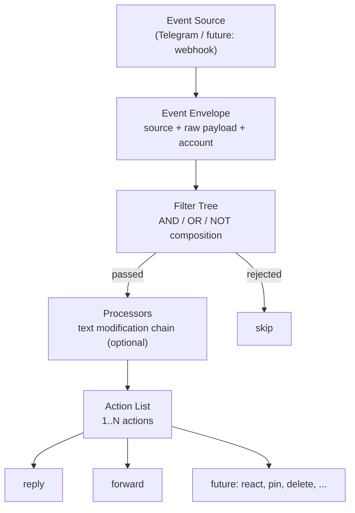
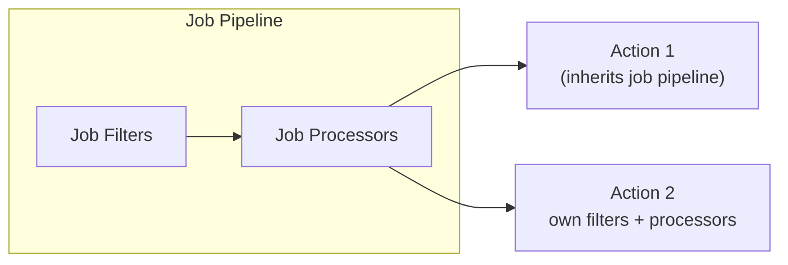
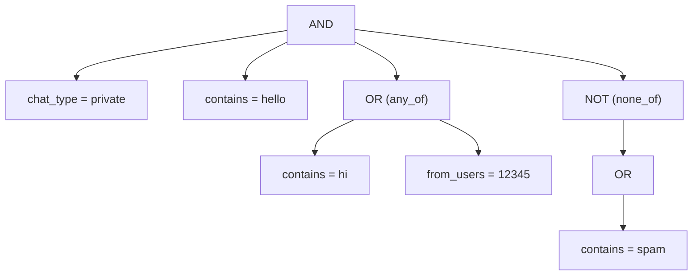
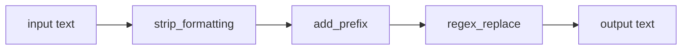
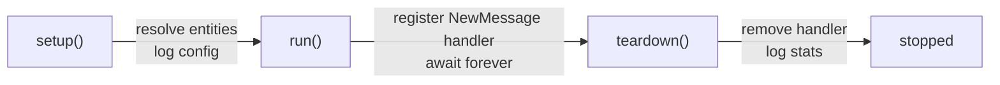

# Gateway

The Gateway is tlgr's generic event-driven pipeline engine. Each job is a declarative pipeline that reacts to incoming Telegram events -- no code required, just YAML.

## Pipeline



Each action in the list can override the job-level filters and processors:



## Event Envelope

Defined in `event.py`. Intentionally thin -- filters extract what they need from `raw` directly.

```python
@dataclass(slots=True)
class Event:
    source: str          # "telegram", "webhook", etc.
    raw: Any             # original Telethon event or webhook payload
    account: str         # which account received it
    timestamp: datetime
```

## Configuration

Jobs live in `~/.tlgr/jobs.yaml`:

```yaml
jobs:
  - name: my-job
    account: main
    enabled: true           # default: true
    filters:                # optional
      chat_type: private
    processors:             # optional, job-level
      - strip_formatting
    actions:
      - reply: "hello!"
      - forward:
          to: ["@archive"]
          processors: [add_prefix:prefix=[FWD]]  # overrides job-level
```

### Action syntax

Actions use concise syntax -- the action name is the key:

```yaml
# Simple: string value
- reply: "hello!"

# Complex: dict value with sub-keys
- forward:
    to: ["@dest1", "@dest2"]
    drop_author: true
    filters:
      has_media: true
    processors:
      - strip_formatting
```

## Filters

Registry-based, composable. Top-level keys are AND'd. `any_of` gives OR, `none_of` gives NOT. These can nest arbitrarily.



```yaml
filters:
  chat_type: private
  contains: [hello]
  any_of:
    - contains: [hi]
    - from_users: [12345]
  none_of:
    - contains: [spam]
```

### Built-in filters

#### Event context (`context.py`)

| Filter | Description | Value |
|--------|-------------|-------|
| `chat_type` | private, group, supergroup, channel | `str` or `list` |
| `chat_id` | Match by chat ID or @username | `int/str` or `list` |
| `chat_title` | Regex match on chat title | `str` (pattern) |
| `is_incoming` | Incoming vs outgoing | `bool` |
| `sender_is_bot` | Sender is a bot | `bool` |
| `sender_is_self` | Sent by yourself | `bool` |

#### Content (`content.py`)

| Filter | Description | Value |
|--------|-------------|-------|
| `contains` | All keywords must appear (case-insensitive) | `list[str]` |
| `contains_any` | At least one keyword | `list[str]` |
| `excludes` | No listed keyword may appear | `list[str]` |
| `regex` | Text must match pattern | `str` (pattern) |
| `has_links` | Has URL entities | `bool` |

#### Message attributes (`message.py`)

| Filter | Description | Value |
|--------|-------------|-------|
| `types` | Message type whitelist | `list[str]` |
| `exclude_types` | Message type blacklist | `list[str]` |
| `has_media` | Has media attachment | `bool` |
| `is_reply` | Is a reply | `bool` |
| `is_forward` | Is forwarded | `bool` |

Valid types: `text`, `photo`, `video`, `document`, `sticker`, `voice`, `video_note`, `audio`, `poll`, `location`, `live_location`, `contact`, `game`, `invoice`, `dice`, `gif`, `webpage`.

#### Temporal (`temporal.py`)

| Filter | Description | Value |
|--------|-------------|-------|
| `after` | Message date >= cutoff | `str` (date or relative: `7d`, `2w`, `1m`) |
| `before` | Message date <= cutoff | `str` |
| `time_of_day` | Within time range | `str` (`"HH:MM-HH:MM"`) |

#### User (`user.py`)

| Filter | Description | Value |
|--------|-------------|-------|
| `from_users` | Sender must be in list | `list[int]` |
| `exclude_users` | Sender must NOT be in list | `list[int]` |

### Adding a custom filter

```python
# tlgr/filters/my_filter.py
from tlgr.filters import register_filter

@register_filter("text_length")
def filter_text_length(event, value):
    if event.source != "telegram":
        return False, "requires telegram"
    text = event.raw.message.text or ""
    if len(text) >= int(value):
        return True, "long enough"
    return False, f"text too short ({len(text)})"
```

Import in `tlgr/filters/__init__.py`, then use in YAML:

```yaml
filters:
  text_length: 10
```

## Processors

Text modification functions applied in sequence. Per-action processors override job-level.



### Built-in processors

| Processor | Description | Config |
|-----------|-------------|--------|
| `replace_mentions` | Replace @mentions | `replacement`, `pattern` |
| `remove_links` | Remove URLs | `replacement` |
| `remove_hashtags` | Remove #hashtags | `replacement` |
| `strip_formatting` | Normalize whitespace | -- |
| `add_prefix` | Prepend text | `prefix` |
| `add_suffix` | Append text | `suffix` |
| `regex_replace` | Custom regex | `pattern`, `replacement`, `flags` |

Config formats in YAML:

```yaml
processors:
  - strip_formatting                      # name only
  - add_prefix:prefix=[NEWS]              # inline config
  - type: regex                           # dict form
    pattern: "sponsor"
    replacement: ""
    flags: i
```

### Adding a custom processor

```python
from tlgr.processors import register_processor

@register_processor("uppercase")
def uppercase(text, config=None):
    return text.upper()
```

## Actions

### Built-in actions

#### reply

Sends a static text reply to the triggering message.

```yaml
- reply: "hello!"
```

#### forward

Forwards the message to one or more destinations.

```yaml
- forward:
    to: ["@clean_feed", "@archive"]
    drop_author: true
    processors: [strip_formatting]
```

| Key | Type | Description |
|-----|------|-------------|
| `to` | `str` or `list[str]` | Destination chat(s) |
| `drop_author` | `bool` | Remove original author |
| `processors` | `list` | Override job-level processors |
| `filters` | `dict` | AND'd with job-level filters |

### Adding a custom action

```python
from tlgr.actions import register_action

@register_action("react")
async def action_react(event, config, client, chain=None):
    if event.source != "telegram":
        return
    emoji = str(config)
    await client.react_to_message(event.raw.chat_id, event.raw.message.id, emoji)
```

```yaml
- react: "thumbs_up"
```

## Engine lifecycle



The `Gateway` class extends `BaseJob`, integrating with the daemon's `JobRunner` lifecycle. On each incoming event:

1. Wrap in `Event` envelope
2. Evaluate the filter tree
3. If passed, iterate over actions
4. For each action: check per-action filters, resolve processor chain, execute

## Managing jobs

```bash
tlgr job add           # open jobs.yaml in $EDITOR
tlgr job list          # show jobs and status
tlgr job enable <name>
tlgr job disable <name>
tlgr job remove <name>
tlgr config validate   # check YAML + validate names against registries
```

No code changes needed for new jobs -- the Gateway engine handles any combination of registered filters, processors, and actions.
